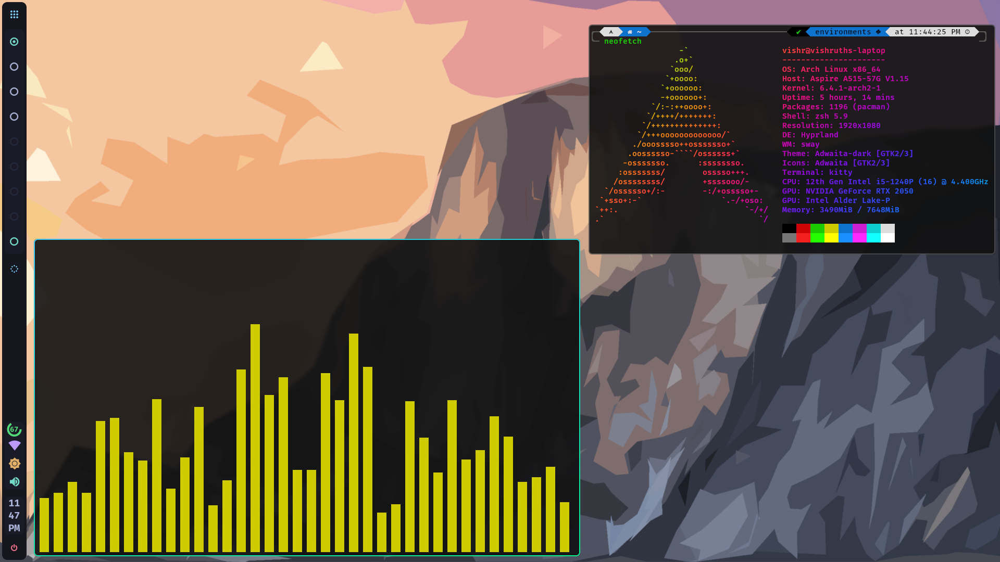

# Hyprland Configuration with Eww

### [Hyprland](https://github.com/hyprwm/Hyprland "Hyprland")

### [Eww](https://github.com/elkowar/eww "Eww")

### References

* [Sidebar by rxyhn](https://github.com/rxyhn/bspdots)
* [Dashboard by adi1090x](https://github.com/adi1090x/widgets)

### Other packages used:

* **hyprpaper**
* **playerctl**
* **dunst**
* **swaylock**
* **swayidle**
* **xss-lock**
* **cliphist**
* **bright**

For weather info, rename eww/dashboard/apis.sample.sh to rename eww/dashboard/apis.sh and add openweather api and city to the file.

#### Optional

* **polkit-gnome** and **gnome-keying**

